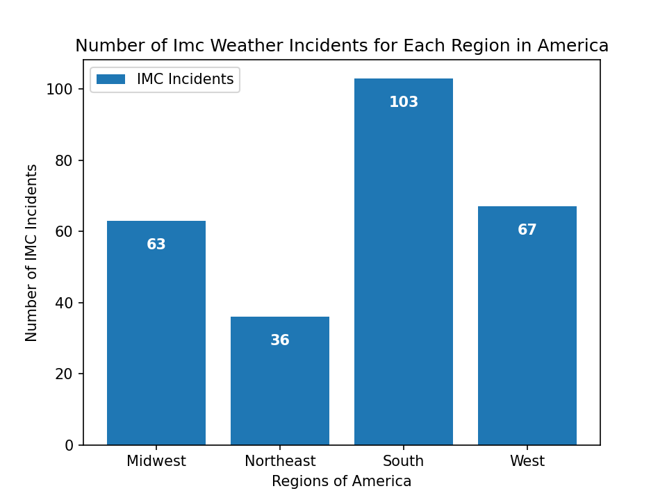
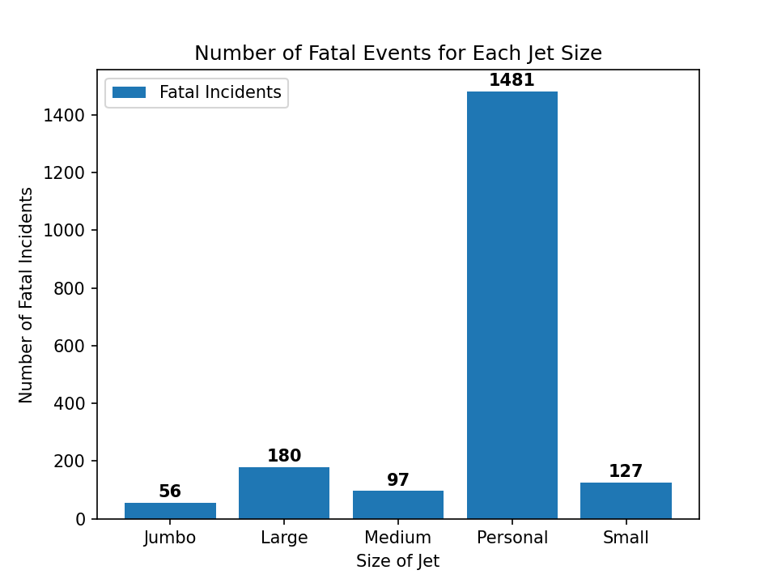
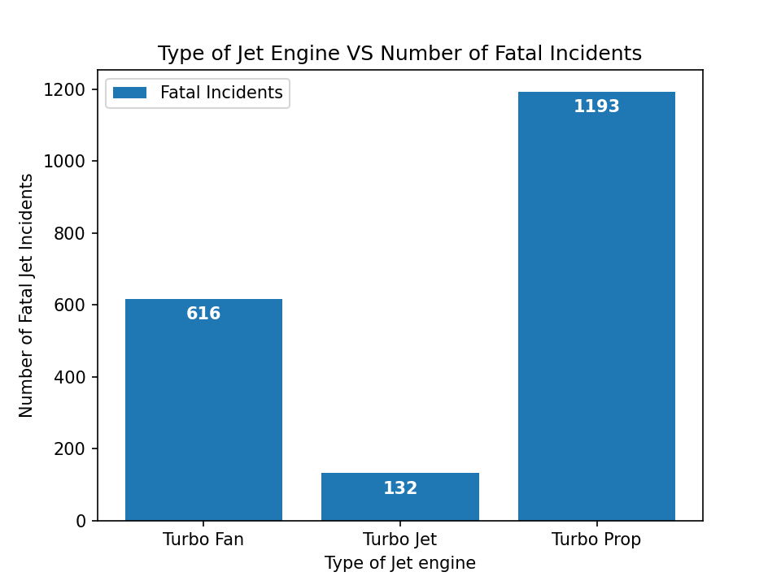

# Aviation Data Analysis

Author: [Andrew Reusche](https://www.linkedin.com/in/andrew-reusche-1397bb311/)

## Project Overview 

As technology has advanced, today's aircraft market has become saturated with
countless options for different kinds of aircraft. With all these options it
is hard to immediately know which variants are safer, and which variants are
more prone to accidents. This project analyzes problematic flights in an
attempt to understand what factors may lead to undesired occurrences.
Descriptive analysis of this data shows that certain factors such as the
type of engine or aircraft size may point to which types are aircraft are
more prone to fatal incidents. My company can use this analysis to help
understand the risks of investing in different types of airplane operations.

### Business Problem

My company would like to invest in new industries to diversify its portfolio.
Specifically, they are interested in purchasing and operating airplanes for
commercial and private enterprises, but first need to learn more about the
potential risks of different kinds of aircraft. Shedding light on these risks
could help guide my company to make aircraft operation selections that are less
problematic. By analyzing the NTSB Aviation Accident Dataset I describe patterns
in engine types, aircraft passenger capacities, and operation regional locations
to help anticipate which aircraft operations will have the lowest risks for the
investors.

### Data Understanding 

The [NTSB aviation accident database](https://www.kaggle.com/datasets/khsamaha/aviation-accident-database-synopses/data) includes information on civil aviation
accidents and certain incidents from 1962 onward, covering the United States,
its territories/possessions, and international waters. The dataset from the 
database has 90,348 records of problematic flights from 1962 to 2023 with 93%
of these data points coming from the USA. Each record refers to the date, 
location, and severity of each event, along with information about the type of 
aircraft involved in the incident (i.e. make, model, engine type...). Due to 
this Dataset not including the total instances of all flights, and only showing 
the problematic flights, we cannot gauge a true estimation of which aircraft are 
more incident-prone. Because of this, we can only use this dataset to highlight 
what attributes were present in the flights that experienced the least amount of 
fatalities and navigation difficulties. The analyses to follow are presented given 
this contextual clarification.

### Methods

This project uses Data Cleaning, Feature Engineering, and Descriptive Analysis to
highlight key characteristics commonly found in the problematic and fatal flights
outlined in the NTSB Aviation Accident Dataset. 

### Results

During the 1962-2023 period, the Northeast Region of the USA experienced the 
least amount of Airplane incidents during Instrument Meteorological Conditions. 
Holding all other factors constant this makes the Northeast region of the USA
the safest region of the USA to operate aircraft in.

From the below graph, we can see that during the 1962-2023 period, Personal
Aircrafts (aricrafts that have a carrying capacity of 10 or fewer people)
have experienced more than three times the amount of Fatal incidents than
all of the other plane capacity categories combined.

From the below graph, we can see that during the 1962-2023 period, Jets that
utilize the Turbo Jet Engine have experienced the fewest amount of fatal
incidents, compared to Jets that use other types of Engines.

### Results

This analysis resulted in 3 recommendations for investing in a new jet operation.
Implementing these recommendations into the criteria for selecting a Jet operation
to invest in will help minimize the risk of undesirable events, such as fatalities
and unfavorable flight conditions.

1) Invest in jets that mainly operate in the Northeast region of the USA. In
terms of weather conditions, it is more difficult to operate aircraft during
Instrument Meteorological Conditions (IMC) than Visual Meteorological
Conditions (VMC). According to this dataset, from 1962 to 2023, The Northeast
region of America, compared to the other regions of America, has experienced
the fewest fatal jet incidents that took place during IMC.

2) Invest in jets that have larger passenger-carrying capacities. According
to this dataset, in America, jets with the capacity to carry over 10 people
have experienced over 3X fewer fatal incidents than jets that can only carry
10 or less people (Personal Jets). This is even further shown by jets that
can carry over 200 people only experiencing around 4% of the number of fatal
incidents that Personal Jets experienced,

3) Invest in Airplanes that utilize Turbo Jet Engines as a method of propulsion.
According to this dataset, in America, airplanes that use Turbo Jet Engines
have experienced a lower amount of fatal incidents, than other jet engine
types, over a 60 year span.

This allows us to break into the market with a minimized risk, while entering at
a lower price point. With this, we can expand faster to the rest of the country 
and with additional types of jets once we have solidified our place in the market 
and gained customer confidence. 

### Next Steps

Additional analysis could help further minimize the risk our company takes on
when selecting a new aircraft operation to invest in by bringing additional
insights to light.

1) Jet improvement analysis. This model could display which types of jets
have improved the most over the years and now have a smaller chance of
experiencing a fatal incident.
    
2) Flight purpose analysis. This model could display which types of flights
are more prone to experiencing fatal incidents. 
    
3) Risk predictor model. Given details about a potential flight, this model
could help predict the level of incident severity a flight could result in. 

## For More Information

See the full analysis in the [Jupyter Notebook](Jet_Analysis_V3.ipynb), and review this [presentation](Presentation1.pdf) or view the [Analysis Tableau Dashboard](https://public.tableau.com/app/profile/andrew.reusche/viz/Jet_AnalysisDashboard/Dashboard1). 

For additional information contact Andrew John Reusche at a.j.reusche@gmail.com

## Repository Structure

├── .gitignore

├── data2

├── images2

├── README.md

├── Presentation1.pdf

└── Jet_Analysis_V3.ipynb
